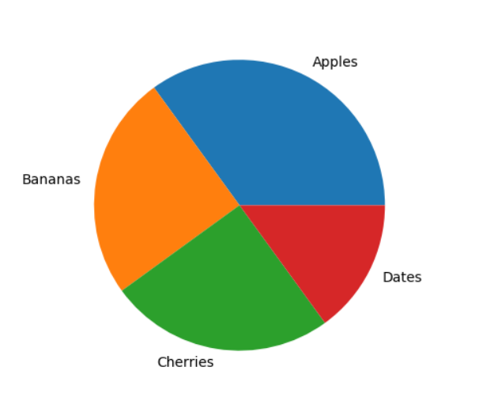

# MachineLearning_debutant

## Python Matplotlib :

Matplotlib is a low level graph plotting library in python

The useful functions or arguments in this library:

- Matplotlib Grid Lines and Labels
- Matplotlib Scatter
- Matplotlib Bars
- Matplotlib Histograms
- Matplotlib Pie Charts

---

## Machine Learning

Machine Learning is a program that analyses data and learns to predict the outcome. and this is a step into the direction of artificial intelligence (AI).

### I worked on the subjects below in the w3schools site :

- Standard Deviation
- Percentiles
- Data Distribution
- Scatter Plot
- Scale
- Train/Test
- Confusion Matrix
- K-means etc...

